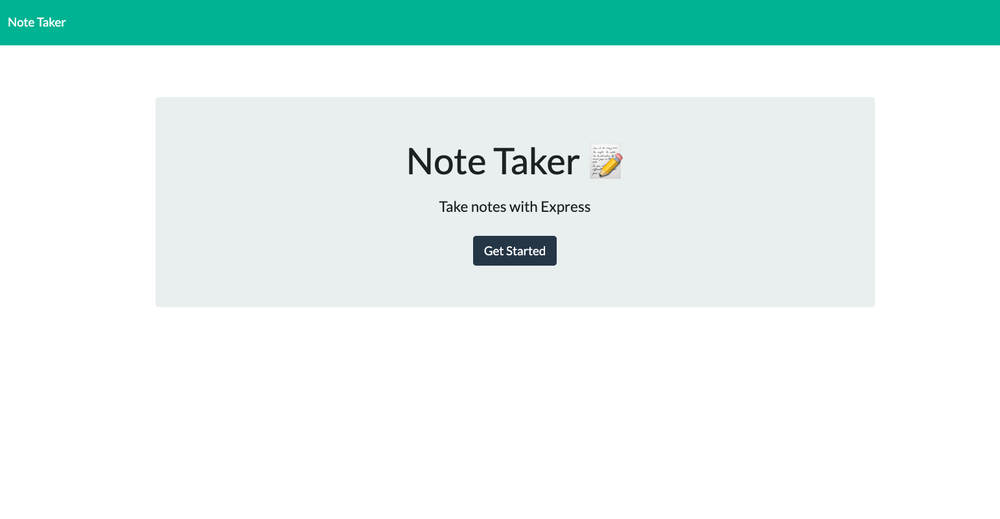
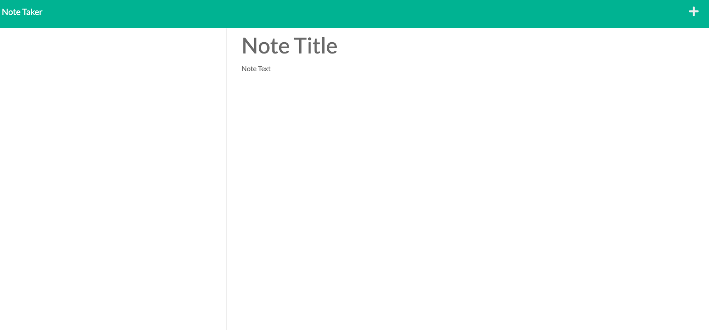
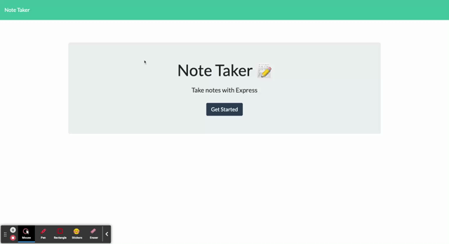

# Note_Taker

This application is a simple notes application. It provides the ability to create notes and save them as well as delete them. 

## Installation
To access codebase,

Go to https://github.com/jgporter24/Note_Taker
Click Code
Select Download Zip or Clone onto local device by copying the link https://github.com/jgporter24/Note_Taker.git into gitbash/terminal on your machine
Open files in preferred text editor or web browser

## User Story

AS A small business owner
I WANT to be able to write and save notes
SO THAT I can organize my thoughts and keep track of tasks I need to complete

## Usage

The following images and video show functionaity:

## Credits

Thank you to classmates and office hours. 